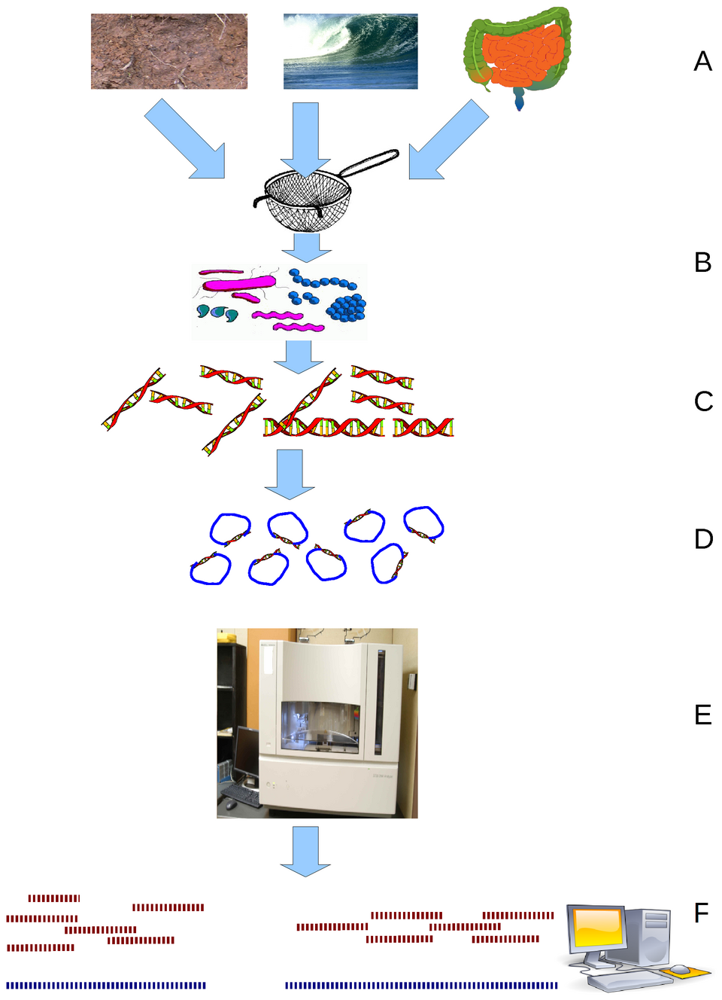
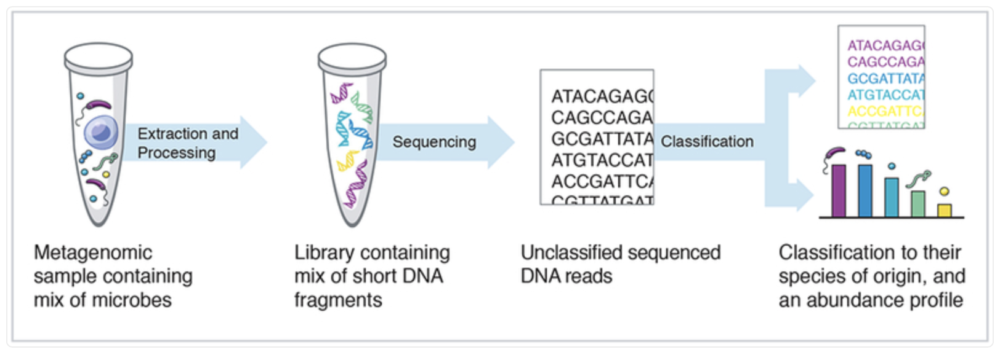
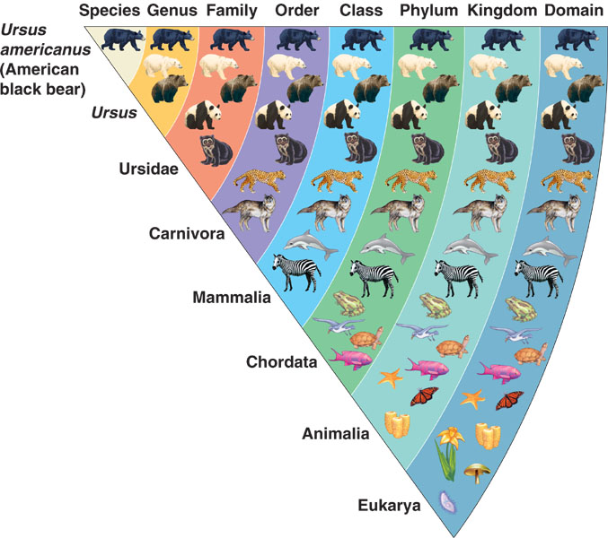
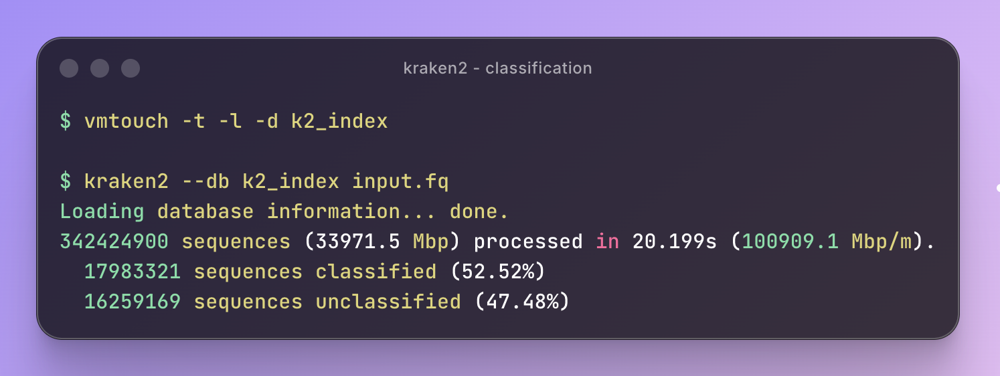

# Classifying Billion base-pairs/second

Chillar Anand ([avilpage.com](https://avilpage.com))

---
## Agenda

- What is meta-genomic analysis?
- Taxanomic classification tools
- Intro to Kraken2
- Speeding up Kraken2

---
## What is Meta-Genomics?

Study of all organims in a community by their DNA.
Ex: Soil sample, gut microbiome, ocean water, etc.

 

Can a scoop of mud give you latitude/longitude?
Can we detect an outbreak in cities of before doctors?

---
## Abundance Profile & Taxonomy

[//]: # (## Classification Tools)

[//]: # ()
[//]: # (![]&#40;class-tools.png&#41;)

[//]: # ()
[//]: # (---)

---
## Sub-string search

---
## Kraken2 Index

---
## Faster Classification

---
## References

- https://github.com/DerrickWood/kraken2

- https://github.com/hoytech/vmtouch

- https://avilpage.com/tags/kraken2.html

- https://pmc.ncbi.nlm.nih.gov/articles/PMC6716367/
